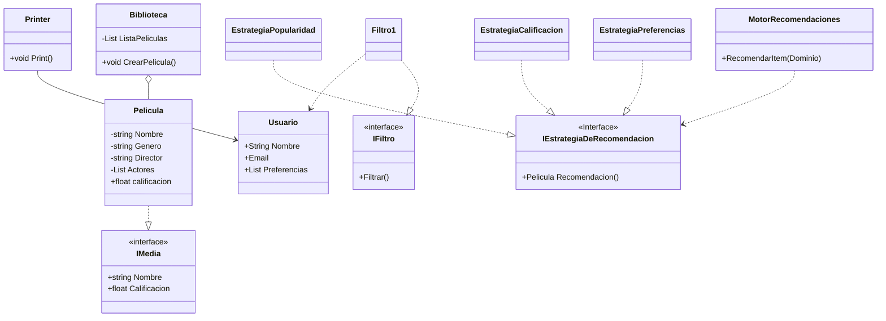

```mermaid
classDiagram
%%Usuario
class Usuario{
    +String Nombre
    +Email
    +List Preferencias

    %%Capaz poner
    %%+List LikedMedia
    %%+List GetLikedActores()
    %%+List GetLikedDirectors()
    %%+List GetLikedGeneros()
}

class Biblioteca{
    -List ListaPeliculas
    +void CrearPelicula()
}

class IMedia{
    <<interface>>
    +string Nombre
    +float Calificacion
}

class Pelicula{
    -string Nombre
    -string Genero
    -string Director
    -List Actores
    +float calificacion

}

class MotorRecomendaciones{
    +RecomendarItem(Dominio)
}

%%Estrategias De Recomendaciones
class IEstrategiaDeRecomendacion{
    <<Interface>>
    +Pelicula Recomendacion()
}

class EstrategiaPreferencias{}
class EstrategiaCalificacion{}
class EstrategiaPopularidad{}

%%Filtros
class IFiltro{
    <<interface>>
    +Filtrar()
}
class Filtro1{}

class Printer{
    +void Print()
}


%%Relaciones
Biblioteca o-- Pelicula

MotorRecomendaciones ..> IEstrategiaDeRecomendacion

%%Dependencias del multimedia
Pelicula ..|> IMedia

%%Dependencias de las estrategias
EstrategiaPreferencias ..|> IEstrategiaDeRecomendacion
EstrategiaCalificacion ..|> IEstrategiaDeRecomendacion
EstrategiaPopularidad ..|> IEstrategiaDeRecomendacion

%%Dependencia de los filtros
Filtro1 ..|> IFiltro
Filtro1 ..> Usuario

%%Imprimir Texto Recomendacion
Printer --> Usuario
```